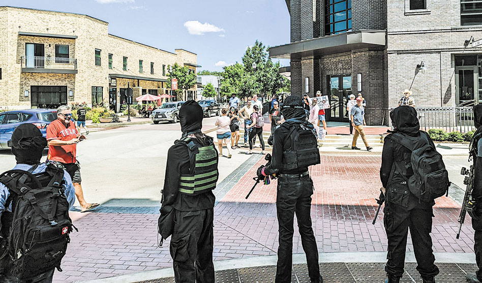
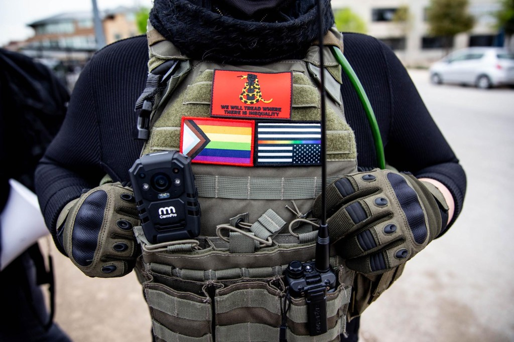
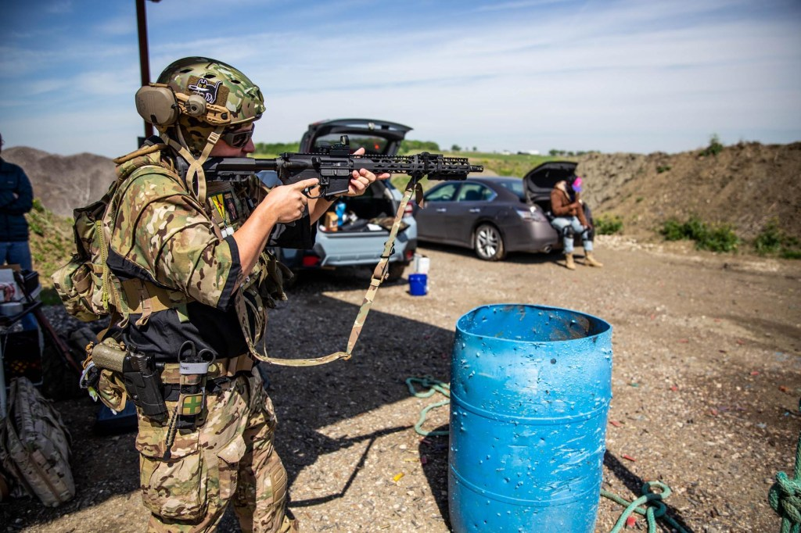
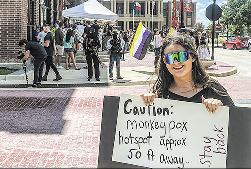
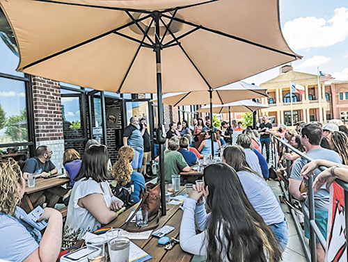
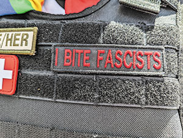
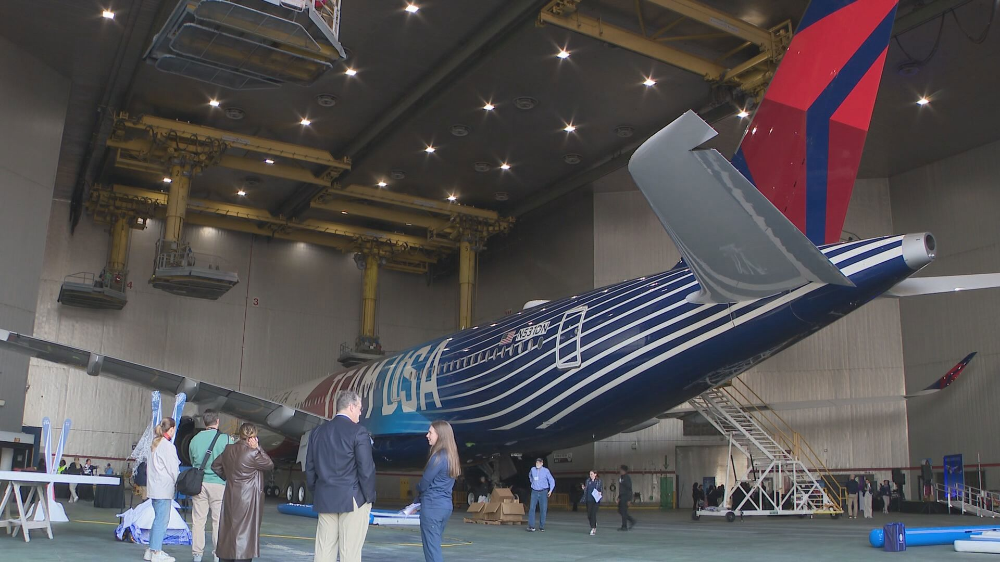

# Appendix F: Visual References & Image Sources

*This appendix provides links to publicly available imagery of key individuals and groups. Images should be downloaded and archived locally for operational use.*

---

## ✅ Collected Images

### Elm Fork John Brown Gun Club — Armed Security at Drag Events

*Elm Fork John Brown Gun Club members providing armed security at Anderson Distillery drag brunch, Roanoke, TX (August 2022). Note tactical vests, face coverings, Pride flags, and open-carry rifles. Photo: Steven Monacelli / Dallas Voice*

---

*John Brown Gun Club members featured in Rolling Stone (May 2023)*

---

*Additional JBGC imagery from Rolling Stone feature article*

---

### Anti-Drag Protest Organizer

*Kelly Neidert, founder of Protect Texas Kids, at Roanoke counter-protest. Photo: Steven Monacelli / Dallas Voice*

---

### Event Imagery

*Overflow crowd outside Anderson Distillery drag brunch, Roanoke, TX (August 2022). Photo: Dallas Voice*

---

*Detail of antifascist patch worn by JBGC security member. Photo: Dallas Voice*

---

### Dallas Protest Activity

*George Floyd / BLM protest in downtown Dallas (2020). NGAN and Dominique Alexander were prominent organizers of Dallas-area protests. Photo: WFAA*

---

*All photos credited to original sources. Collected for internal security reference only.*

---

## F.1 Key Individuals

### Dominique Alexander (NGAN Founder)

| Source | URL | Notes |
|--------|-----|-------|
| **Instagram** | [instagram.com/niquealex](https://www.instagram.com/niquealex/) | 56K followers; many photos |
| **Facebook** | [facebook.com/dominique.alexander.169](https://www.facebook.com/dominique.alexander.169/) | Profile photos, event photos |
| **Twitter/X** | [x.com/niquealex](https://x.com/niquealex) | Profile photo |
| News Coverage | Search "Dominique Alexander Dallas" on Google Images | Multiple news photos from protests, press conferences |

**Description:** African American male, typically seen at protests/rallies wearing casual or protest attire. Often photographed with megaphone. Public figure — many images available.

---

### Kelly Neidert (Protect Texas Kids Founder)

| Source | URL | Notes |
|--------|-----|-------|
| News Coverage | Search "Kelly Neidert Texas" on Google Images | UNT campus photos, protest photos |
| Dallas Voice | [dallasvoice.com/drag-in-the-suburbs/](https://dallasvoice.com/drag-in-the-suburbs/) | Photo in article (credited Steven Monacelli) |
| Rumble | Search "Kelly Neidert" | Interview videos |

**Description:** Young white female, typically seen at anti-drag protests. Former UNT student. Public activist — images available through news coverage.

---

### Kristian Hernandez (DSA North Texas Co-Chair)

| Source | URL | Notes |
|--------|-----|-------|
| DSA National | [socialistmajority.com/kristian](https://www.socialistmajority.com/kristian) | Official DSA bio/photo |
| Dallas Morning News | Search archives | 2018 coverage of DSA |

**Description:** DSA National Political Committee member; serves on Dallas Community Police Oversight Board.

---

## F.2 Group Imagery

### Elm Fork John Brown Gun Club

| Source | URL | Notes |
|--------|-----|-------|
| **Dallas Voice Article** | [dallasvoice.com/drag-in-the-suburbs/](https://dallasvoice.com/drag-in-the-suburbs/) | Multiple photos by Steven Monacelli showing armed members at drag brunch (August 2022) |
| **Archive.org Video** | [archive.org/details/armed-march-guns-shown-11-22-2022-elm-fork-jbgc-540p](https://archive.org/details/armed-march-guns-shown-11-22-2022-elm-fork-jbgc-540p) | Video of armed LGBTQ march in Austin, November 2022 |
| **Rolling Stone** | [rollingstone.com/culture/culture-features/john-brown-gun-club-armed-anti-fascist-1234733200/](https://www.rollingstone.com/culture/culture-features/john-brown-gun-club-armed-anti-fascist-1234733200/) | May 2023 feature with photos |
| **Reddit** | [reddit.com/r/ShermanPosting/comments/138vytm/](https://www.reddit.com/r/ShermanPosting/comments/138vytm/) | Viral photo from drag show |
| **WFAA Coverage** | Search "Elm Fork John Brown Gun Club WFAA" | April 2023 Fort Worth arrest video |
| **Steven Monacelli Twitter** | [@stevanzetti](https://x.com/stevanzetti) | Journalist who covers them extensively |

**Visual Characteristics:**
- Black tactical gear/vests
- Face masks/coverings (anonymity)
- Pride flags, antifa patches
- Open carry rifles (AR-15 style) and pistols
- Often in groups of 5-15

---

### PSL DFW (Party for Socialism and Liberation)

| Source | URL | Notes |
|--------|-----|-------|
| **Instagram** | [instagram.com/psl.dfw](https://www.instagram.com/psl.dfw/) | 11K followers; extensive photo archive of protests, events |
| **Facebook** | [facebook.com/PSLDFW](https://www.facebook.com/PSLDFW/) | Event photos |

**Visual Characteristics:**
- Red flags, banners with PSL branding
- "Liberation" newspaper
- Socialist imagery (raised fist, etc.)
- Generally not armed

---

### DSA North Texas

| Source | URL | Notes |
|--------|-----|-------|
| **Instagram** | [instagram.com/dsanorthtexas](https://www.instagram.com/dsanorthtexas/) | Event photos, canvassing, rallies |
| **Facebook** | [facebook.com/DSANorthTexas](https://www.facebook.com/DSANorthTexas/) | — |

**Visual Characteristics:**
- Red rose imagery (DSA logo)
- Generally casual dress at events
- Labor/union imagery
- Not armed

---

### NGAN (Next Generation Action Network)

| Source | URL | Notes |
|--------|-----|-------|
| **Facebook** | [facebook.com/NextGenAction](https://www.facebook.com/NextGenAction/) | 20K+ likes; protest photos |
| **Website** | [thengan.com](https://www.thengan.com) | Official imagery |
| News Archives | Search Dallas Morning News, WFAA | 2016-2020 protest coverage |

**Visual Characteristics:**
- "NGAN" branded shirts/signs
- BLM imagery
- Megaphones, protest signs
- Generally not armed

---

### Prairieland Defendants

| Source | URL | Notes |
|--------|-----|-------|
| **The Guardian** | [theguardian.com/us-news/2025/dec/18/texas-antifa-ice-detention-center](https://www.theguardian.com/us-news/2025/dec/18/texas-antifa-ice-detention-center) | DOJ evidence images (fireworks at scene) |
| **KERA News** | [keranews.org/tags/prairieland-detention-center](https://www.keranews.org/tags/prairieland-detention-center) | Court coverage, defendant photos |
| **Dallas Morning News** | Search archives | Court appearance photos |
| **Court Records** | PACER (federal court system) | Booking photos may be in filings |
| **Defense Website** | [prairielanddefendants.com](https://prairielanddefendants.com/) | May have supporter imagery |

**Note:** Booking photos/mugshots typically available through:
- Federal court filings (PACER)
- Local news coverage of arraignments
- Texas jail records (if held in county facilities)

---

### New Columbia Movement / Protect Texas Kids

| Source | URL | Notes |
|--------|-----|-------|
| **YouTube** | [youtube.com/watch?v=rTlBJ2oonhY](https://www.youtube.com/watch?v=rTlBJ2oonhY) | Documentary: "White nationalist Patriot Front meets Christian nationalist New Columbia Movement" |
| News Coverage | Star-Telegram, KERA | Protest coverage |

**Visual Characteristics:**
- Cross flags
- Rosary beads
- Religious imagery
- Signs about "protecting kids"

---

## F.3 Location Imagery

### NGAN Headquarters
**Address:** 1808 S. Good Latimer Expressway, Dallas, TX 75226

| Source | URL |
|--------|-----|
| Google Street View | [Google Maps link](https://www.google.com/maps/place/1808+S+Good+Latimer+Expy,+Dallas,+TX+75226) |

### Prairieland Detention Center
**Address:** Alvarado, TX (Johnson County)

| Source | URL |
|--------|-----|
| Google Maps | Search "Prairieland Detention Center Alvarado TX" |
| News Coverage | KERA, Dallas Morning News — facility exterior shots |

### Common Protest Locations

| Location | Imagery Source |
|----------|---------------|
| Dealey Plaza, Dallas | Google Street View; news archives |
| Dallas City Hall | Google Street View; BLM mural photos |
| Sundance Square, Fort Worth | Google Street View |

---

## F.4 Recommended Image Collection

For operational intelligence, client should build a reference library including:

### Priority 1 — Download Immediately
- [ ] Dominique Alexander (multiple angles)
- [ ] JBGC group photos (tactical gear identification)
- [ ] Kelly Neidert (for identification at events)
- [ ] PSL DFW protest imagery (banner/sign identification)

### Priority 2 — Archive for Reference
- [ ] Prairieland defendant photos (as available)
- [ ] DSA leadership photos
- [ ] Protest location imagery
- [ ] Vehicle photos if available (from news coverage)

### Priority 3 — Ongoing Collection
- [ ] Screenshot social media posts with imagery
- [ ] Archive news photos as published
- [ ] Document any activists observed at client events

---

## F.5 Legal Notes

**Fair Use:** Images collected for security/intelligence purposes from public sources generally fall under fair use. However:
- Do not republish commercially
- Do not use for harassment
- Consult counsel if publishing in reports distributed externally

**Social Media:** Most platforms prohibit scraping, but manual saving of publicly posted images for private security use is generally permissible.

**News Photos:** May be subject to copyright; use for internal reference only.
